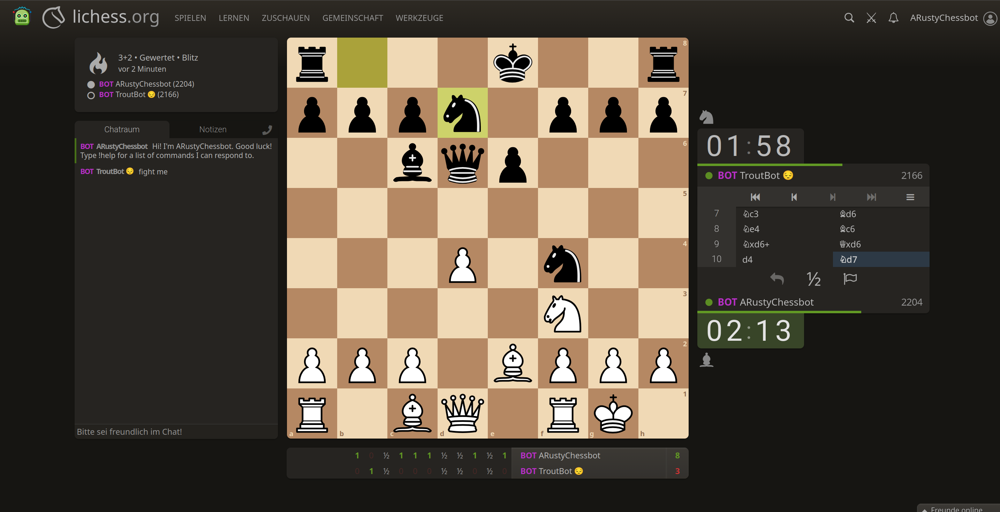

# Rusty ♟️




A high-performance chess engine written in Rust. The current estimated playing strength is around **2200 Elo** in Blitz and Bullet. 

You can watch it play or challenge the bot directly on Lichess here: 
⚔️ **[Challenge Rusty on Lichess](https://lichess.org/?variant=standard&minutesPerSide=3.0&gameMode=casual&increment=2&user=arustychessbot#friend)**

Rusty is self-hosted and might be training or sleeping!

## Technical Overview

Rusty achieves its playing strength not through a complex evaluation function (it currently uses a simple PeSTO evaluation), but through heavy algorithmic optimization and blazing fast search speed.

* **Board Representation:** Bitboards utilizing `PEXT` (BMI2 instructions) for highly efficient sliding piece move generation.
* **Search Algorithms:** Iterative Deepening, Quiescence Search, and Transposition Tables, various Pruning techniques (Alpha-Beta, NMP, RFP, Razoring, ProbCut).
* **Move Ordering:** Static Exchange Evaluation, MVV, History/Capture/Continuation Heuristic, Hash-Move.
* **Interface:** Implements a pragmatic subset of the Universal Chess Interface (UCI) to support matchmaking via Lichess and basic usage in GUIs like *En Croissant*. 

## Build Instructions

Ensure you have the Rust toolchain installed. Clone the repository and build the project using Cargo:

```bash
cargo build --release
```

> ⚠️ **Important Hardware Note:** 
> Because the move generator relies heavily on `PEXT` for performance, your target CPU **must support the BMI2 instruction set** (most Intel CPUs since Haswell/2013 and AMD since Zen 3/2020).